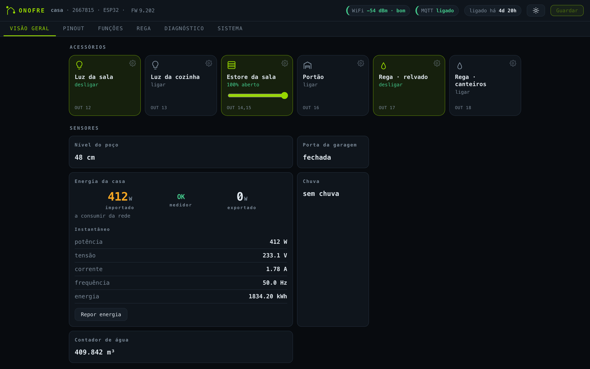
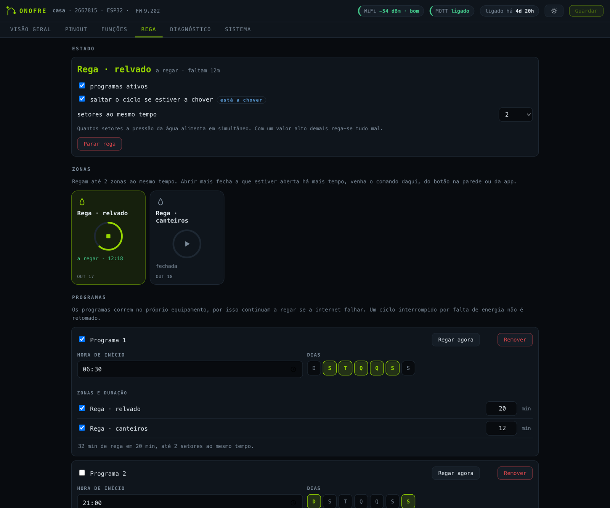
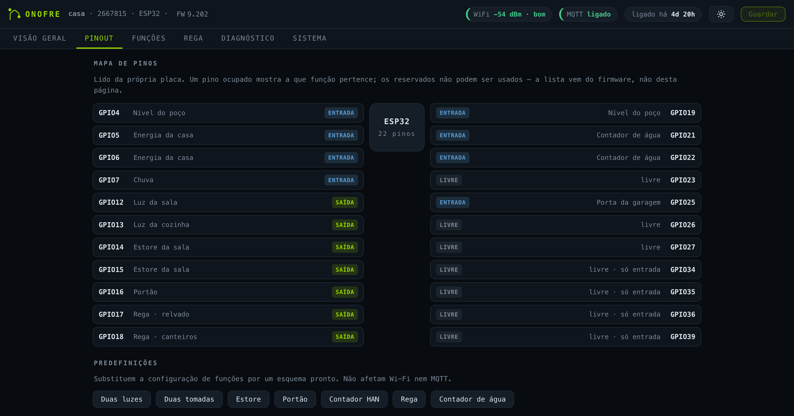
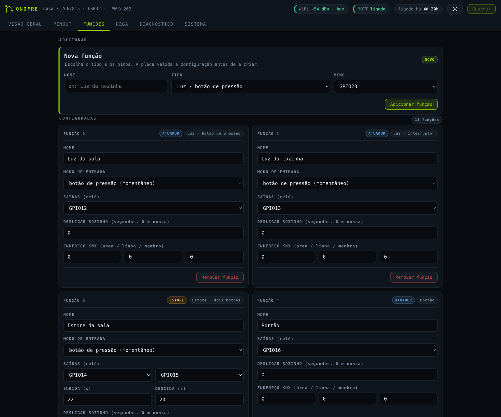
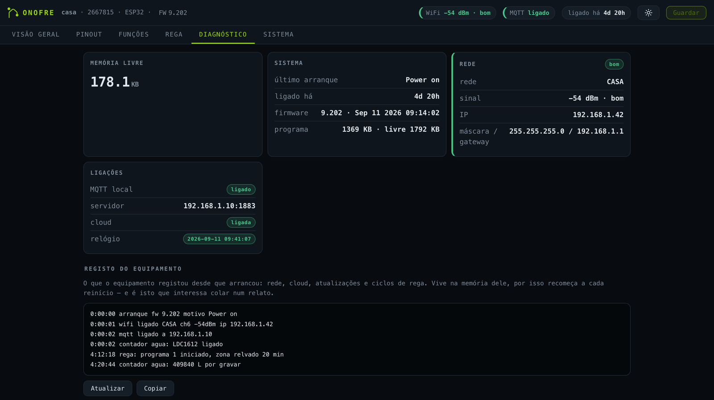
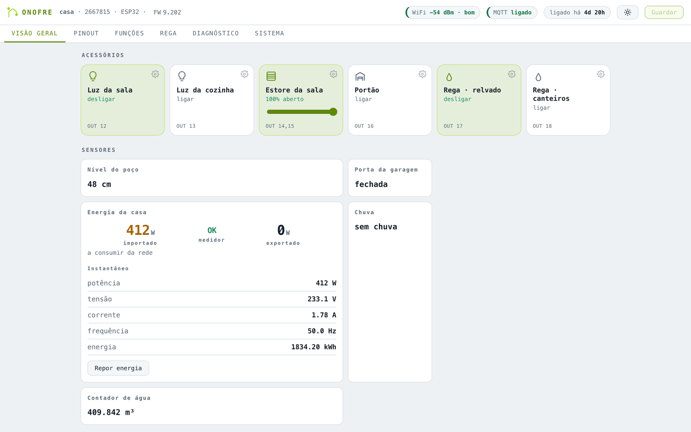
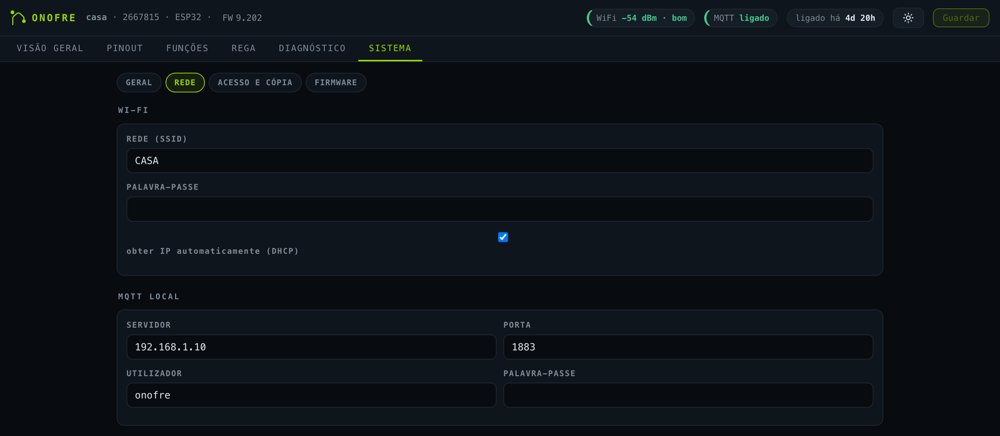
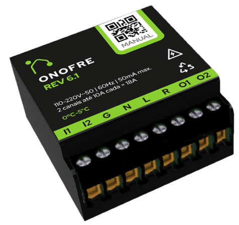
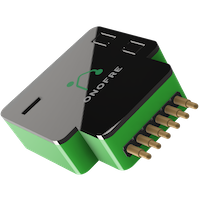

<p align="center">
  
</p>

<h1 align="center">EasyIot</h1>

<p align="center">
  Firmware aberto para automação domiciliária em ESP8266 e ESP32.<br>
  Corre sozinho, sem nuvem obrigatória, e integra-se no Home Assistant por descoberta automática.
</p>

<p align="center">
  
  
  <a href="https://www.paypal.me/bhonofre"></a>
</p>

---

O EasyIot é o firmware oficial das placas **OnOfre** e funciona em qualquer placa
baseada em ESP8266 ou ESP32. Configura-se por um painel web servido pelo próprio
equipamento — sem aplicação para instalar, sem conta para criar, sem ligação à
Internet para funcionar.

Tudo o que o equipamento faz, decide-o ele: as luzes respondem ao botão de parede
mesmo com o Wi-Fi em baixo, e um programa de rega continua a correr se a rede
falhar a meio.

<p align="center">
  
</p>

## O que faz

### Comandar

| | |
|---|---|
| **Luzes e tomadas** | botão de pressão ou interruptor, com desligar automático opcional |
| **Estores** | um botão, dois botões ou dois interruptores, com tempos de subida e descida |
| **Portões** | impulso com tempo configurável |
| **Rega** | electroválvulas com contagem decrescente por zona |

### Medir

| | |
|---|---|
| **Temperatura e humidade** | DHT11, DHT21, DHT22, DS18B20, SHT4X |
| **Energia** | PZEM-004T v1 e v3, e contador da rede por **HAN / Modbus** |
| **Água** | contador de água por indução com o **LDC1612**, lido através do registo do próprio contador |
| **Presença e movimento** | PIR e radar **LD2410** |
| **Distância e nível** | HC-SR04 e TMF882X |
| **Estado** | porta, janela, chuva |
| **Luminosidade** | LTR303 |

### Rega autónoma

Programas com hora de início, dias da semana e duração por zona. O ciclo corre
no equipamento, não na nuvem nem no Home Assistant. Salta o ciclo se o sensor de
chuva estiver activo, e limita quantos sectores abrem ao mesmo tempo — porque a
pressão da água é que decide, não o software.

<p align="center">
  
</p>

### Integrar

| | |
|---|---|
| **MQTT** | broker local, tópicos por função |
| **Home Assistant** | descoberta automática; sensores de energia e água entram nos painéis de Energia e Água |
| **KNX** | endereço de grupo por actuador |
| **OnOfre Cloud** | opcional, para acesso remoto e actualizações |
| **REST + SSE** | `/config`, `/features`, `/irrigation`, `/logs` e um fluxo de eventos ao vivo |

## O painel

Servido pelo equipamento, sem dependências externas — funciona numa cave sem Internet.

**Mapa de pinos lido da própria placa.** Mostra a que função pertence cada pino
ocupado e quais estão reservados. A lista vem do firmware, não da página, por isso
não mente sobre o que aquela placa aceita.

<p align="center">
  
</p>

**Predefinições** para as montagens comuns — duas luzes, duas tomadas, estore,
portão, contador HAN, rega, contador de água — e configuração função a função
quando é preciso sair delas.

<p align="center">
  
</p>

**Diagnóstico** com memória, tempo ligado, estado da rede e das ligações, e o
registo do próprio equipamento — o que ele viu desde que arrancou, que é o que
interessa colar num relato de avaria.

<p align="center">
  
</p>

**Tema claro e escuro**, e o painel adapta-se ao telefone.

<p align="center">
  
</p>

## Instalar

As placas OnOfre já vêm com o firmware instalado e actualizam-se pelo ar. Numa
placa própria, compila e grava — ver [Compilar](#compilar).

1. **Ligar ao ponto de acesso** que a placa cria, `OnOfre-16776767-9x202` por
   exemplo, com a palavra-passe `bhonofre`.
2. **Abrir `http://192.168.4.1`**, escolher a rede Wi-Fi, dar um nome ao
   equipamento e, se quiseres, uma predefinição de funções.
3. **Abrir o painel** em `http://<nome>.local` ou pelo endereço IP.
4. **Configurar as funções** — que pinos, que tipo, que tempos.
5. **Opcional:** apontar o MQTT ao broker do Home Assistant. As entidades
   aparecem sozinhas, sem YAML.

<p align="center">
  
</p>

### Valores por omissão

| | |
|---|---|
| Palavra-passe do ponto de acesso | `bhonofre` |
| Painel web | `admin` / `xpto` |

Ambos se mudam no painel, em **Sistema → Acesso**. Muda-os.

## Hardware

Compila para **ESP8266**, **ESP32**, **ESP32-C3** e **ESP32-C6**. As placas OnOfre
trazem o firmware instalado.

<p align="center">
  
  
</p>

* [Placa OnOfre](https://github.com/brunohorta82/BH_OnOfre)
* [Placa PZEM](https://github.com/brunohorta82/BH_PZEM_ESP8266)

## Compilar

Visual Studio Code com PlatformIO.

```bash
pio run -e ESP8266_RELEASE          # ou ESP32_RELEASE, ESP32C3_HAN, ESP32C6_...
pio run -e ESP8266_RELEASE -t upload --upload-port /dev/cu.usbmodemXXXX
```

Antes de um commit ou pull request:

```bash
python3 tools/check_project.py --quick
python3 tools/check_project.py --build ESP8266_DEBUG    # com compilação
```

A matriz completa das verificações está em
[docs/RELEASE_WORKFLOW.md](docs/RELEASE_WORKFLOW.md#project-checks).

Para ver actualizações de dependências sem mexer no `platformio.ini`:

```bash
python3 tools/audit_dependencies.py
python3 tools/audit_dependencies.py --env ESP8266_DEBUG
```

### Binários locais

Depois de compilar, `tools/export_firmware.py` guarda o binário como candidato,
verifica-o por SHA-256 e, depois de testado na placa, promove-o a versão conhecida
e funcional. Os ambientes com `DEBUG` ou `RELEASE` no nome guardam o candidato
automaticamente no fim de uma compilação bem sucedida. A pasta `firmware_bins/`
é local e está fora do Git.

Comandos de publicação e promoção em
[docs/RELEASE_WORKFLOW.md](docs/RELEASE_WORKFLOW.md#local-firmware-binaries).

## Mais

* [Site oficial](http://onofre.store/)
* [OnOfre Doctor](https://doctor.onofre.store) — diagnóstico remoto
* [Tutoriais em vídeo](https://www.youtube.com/watch?v=OZenBfHWtak&list=PLxDLawCWayzDqAgOpIDJ-DHFAXYd_S-pr)

## Donativos

Se o projecto te foi útil:

[](https://www.paypal.me/bhonofre)

---

<p align="center">
  Feito em Portugal · código aberto
</p>
